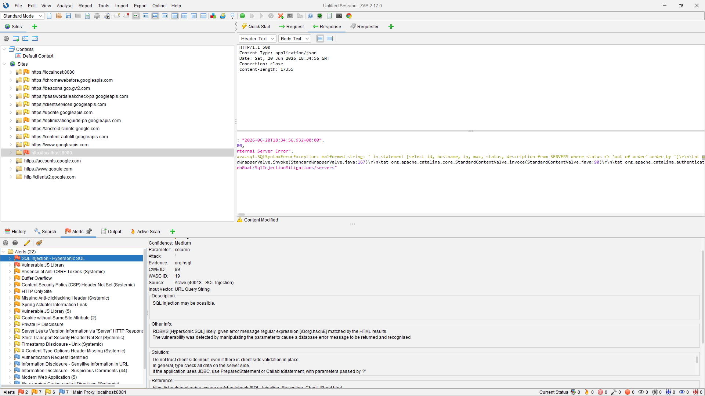
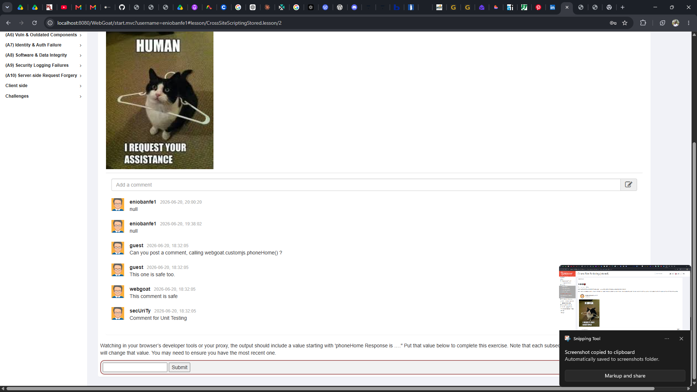
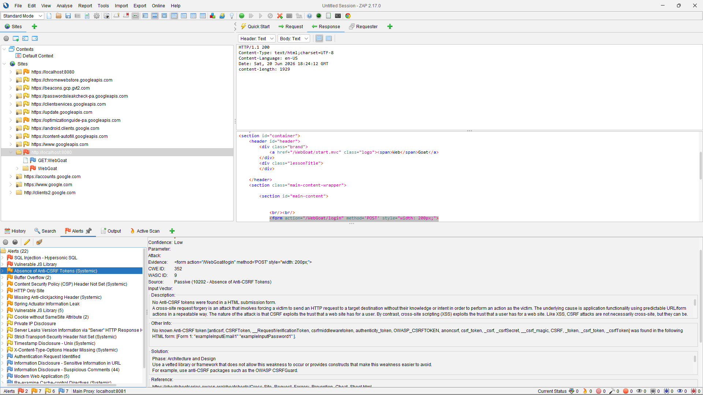

# Web Application Security Assessment — WebGoat

**Cyber Security Internship — Redynox**
**Target Application:** [WebGoat](https://github.com/WebGoat/WebGoat) (OWASP)
**Scanning Tool:** [OWASP ZAP](https://www.zaproxy.org/)

## Overview

This project documents a web application security assessment performed on WebGoat, an intentionally vulnerable application maintained by OWASP, as part of a Cyber Security Internship task. Testing combined OWASP ZAP's automated scanning (passive and active) with manual exploitation to confirm and demonstrate three categories of vulnerabilities: **SQL Injection**, **Cross-Site Scripting (XSS)**, and **Cross-Site Request Forgery (CSRF)**.

## Summary of Findings

| Vulnerability | CWE | Detection Method | Confidence |
|---|---|---|---|
| SQL Injection | CWE-89 | OWASP ZAP Active Scan | Medium |
| Stored XSS | — | Manual exploitation | Confirmed |
| CSRF | CWE-352 | OWASP ZAP Passive Scan | Low |

---

## 1. SQL Injection

**Where it was found:** WebGoat's SQL Injection (Mitigations) lesson, specifically the `servers` endpoint, in the `column` URL query parameter.

**How it was discovered:** Automatically via OWASP ZAP's Active Scan (rule: SQL Injection – Hypersonic SQL).

**Proof of concept:** ZAP injected a single quote (`'`) into the `column` parameter, breaking the SQL query and triggering a server error that leaked the underlying database query:

```
java.sql.SQLSyntaxErrorException: malformed string: ' in statement 
[select id, hostname, ip, mac, status, description from SERVERS 
where status <> 'out of order' order by ']
```

This confirms the application inserts unsanitized user input directly into a SQL query.



**Why it's dangerous:** An attacker could manipulate the query to extract unauthorized data, bypass authentication, or modify/delete records. The exposed stack trace also leaks internal implementation details useful for further attacks.

**Suggested fix:** Use parameterized queries (`PreparedStatement`) instead of string concatenation, validate input server-side, and disable detailed error messages in production.

---

## 2. Cross-Site Scripting (Stored XSS)

**Where it was found:** WebGoat's comment/message board feature, within the Stored XSS lesson.

**How it was discovered:** Manual testing — a JavaScript payload was submitted directly into a comment field.

**Proof of concept:** The following payload was submitted as a comment:

```html
<script>webgoat.customjs.phoneHome()</script>
```

The script executed when the page rendered the comment, successfully calling the `phoneHome()` function — confirming the payload ran in the browser context.



**Why it's dangerous:** Since the payload is stored and runs automatically for any user who views the comment, an attacker could steal session cookies, redirect users to phishing pages, or perform actions on a victim's behalf without their knowledge.

**Suggested fix:** Sanitize and encode all user input before storing or rendering it (e.g. via OWASP's AntiSamy), and apply output encoding so HTML/JavaScript characters are escaped rather than executed.

---

## 3. Cross-Site Request Forgery (CSRF)

**Where it was found:** The WebGoat login form (`/WebGoat/login`, POST method).

**How it was discovered:** Automatically via OWASP ZAP's Passive Scan (rule: Absence of Anti-CSRF Tokens).

**Proof of concept:** ZAP inspected the form HTML and confirmed no anti-CSRF token was present:

```html
<form action="/WebGoat/login" method='POST' style="width: 200px;">
```

ZAP checked for common anti-CSRF token field names (e.g. `csrfmiddlewaretoken`, `CSRFToken`, `authenticity_token`) and found none in the form fields.

> Note: ZAP flagged this with **Low confidence**, since WebGoat intentionally disables CSRF protection on this form for training purposes.



**Why it's dangerous:** Without a CSRF token, the app cannot verify a request genuinely originated from the user's intent. An attacker could craft a page that silently submits this form on a victim's behalf while they're logged in elsewhere.

**Suggested fix:** Implement anti-CSRF tokens on all state-changing forms, validated server-side per session/request. Spring Security (which WebGoat is built on) supports this out of the box; OWASP's CSRFGuard is another option.

---

## Tools Used

- **WebGoat** — intentionally vulnerable application used as the test target
- **OWASP ZAP** — automated vulnerability scanning (passive + active) and manual request inspection
- **Java (JDK 25)** — runtime for the WebGoat standalone jar

## Conclusion

This assessment identified three distinct vulnerability categories within WebGoat, each confirmed through a combination of automated scanning and manual exploitation. The exercise highlighted how a lack of input validation, output encoding, and request-origin verification can compound into serious security risks — and reinforced that parameterized queries, output encoding, and anti-CSRF tokens together address the root causes behind each finding.

---

*This assessment was performed in a local, intentionally vulnerable training environment as part of a cybersecurity internship. No real systems were tested.*
